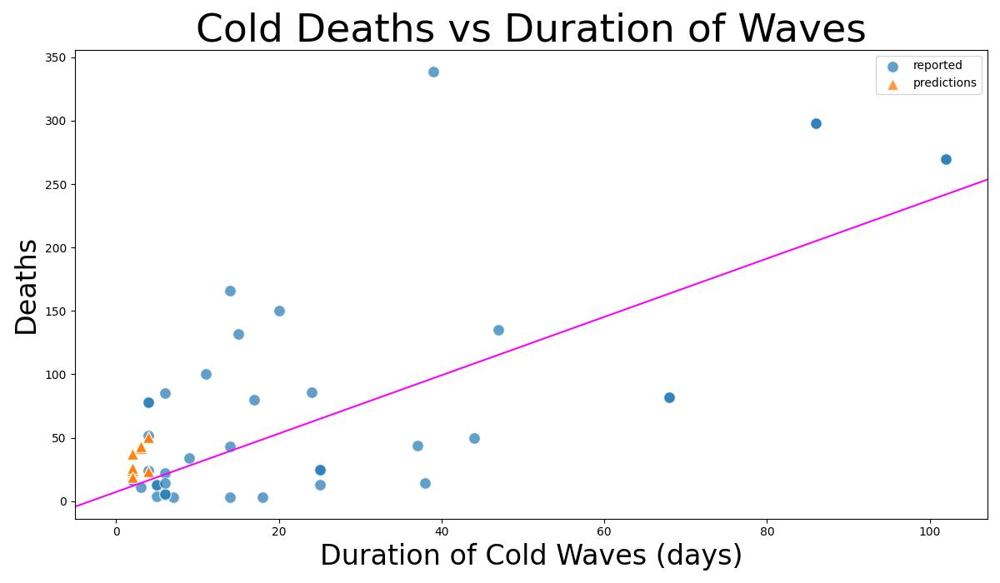
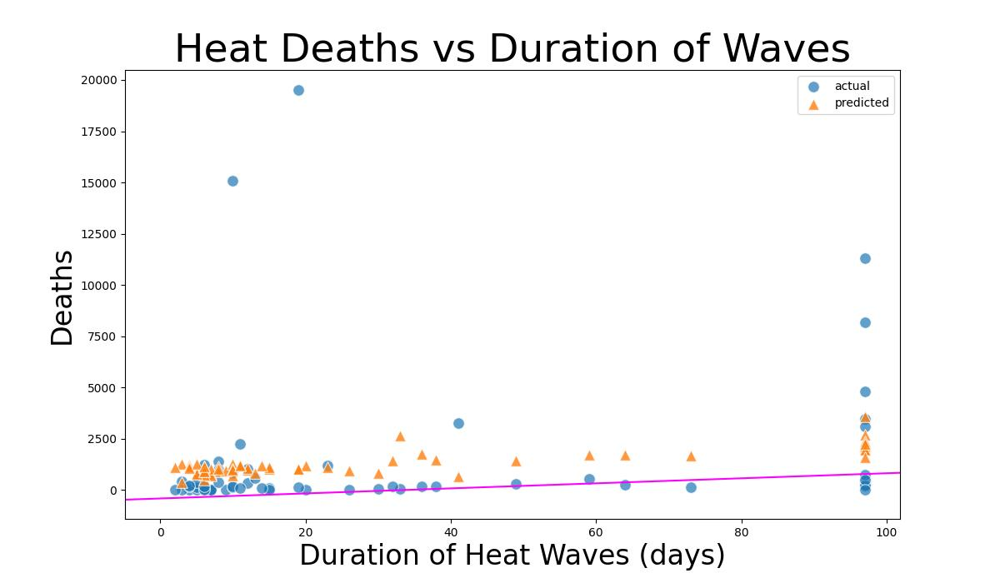

# Unreported Deaths Due to Extreme Temperature Events
Erin De Pree, Sehar Mehmood, Ken Muchira

## Problem Statement
Given that extreme temperature events are likely to increase with global climate change, we want to identify:

* The approximate minimum number of deaths due to unreported extreme temperature events in locations compared to data available independently for regions/locations

Given the following:
* Extreme heat and heat wave events are classified as when temp are above $97.5$% ($+2.5$ standard deviation), location specific mean, and lasting at least 2 days
* Extreme Cold/Cold Wave Events are classified as when temp are below $2.5$% ($-2.5$ standard deviation), location specific mean, lasting at least 2 days

Identification of at-risk countries/underreported countries are determined by:
* publications have mentioned Africa and Middle East as being underreported
* comparing temperature data individually available to locations/regions reporting and not reporting (i.e. identification comes from lack of presence in the international emergency database, EM-DAT)

The timeline explored will look at years 2020-2024 from EM-DAT extreme temp and the dataset of daily surface temperatures (from the ERA5 analysis) covers 2020-2024 (more data is available but is time consuming to download).

## Repo Structure

* [`code`](code) contains all Jupyter notebooks

* [`data`](data) contains all raw, processed, and final datasets

* [`images`](images) holds the most useful images

* [`model_results`](model_results) containts more detailed predictions

* [`research_sources.md`](resourch_sources.md) includes non-data sources of information

* this `README.md` document

* slides for our [`presentation`](presentation.pdf)

* [LICENSE](LICENSE) to use our work

## Cleaning and Early Data Analysis
### EM-DAT data: reported deaths

The [EM-DAT data](code/erin_1/clean_emdat.ipynb) reports the deaths due to extreme temperatures (among other disasters).  However there is an [extreme geographic imbalance](code/erin3_feature_extraction.ipynb) in the reported deaths due to extreme temperatures.

More concerning are the number of deaths per region:

Although Europe contains about 10% of the world's population, it reported over 90% of the extreme temperature deaths.  Thus, it is very likely that large parts of the world are underreporting deaths due to extreme temperatures.  

### ERA5 temperature data

The ERA5 data includes a temperature measured 2 meters above the ground over all land surfaces.  The ERA5 data is available from 1950 to 6 days ago on a 1 degree latitude by 1 degree longitude around the globe.  Unfortuntely, this is an extremely time consuming to download and process (both steps were run overnight).  Therefore, we have restricted ourselves to a 10 degree latitude by 10 degree longitude grid from 2020 to mid-2025. Not all data points were above land, so we had to [process all the files](code/erin2_temp_data.ipynb) (over 700, available on [Google Drive](https://drive.google.com/drive/folders/1yC7wn5CA4mjju9ALo66O8LhqpOVXBVr7?usp=drive_link)) to determine which were helpful and which were not.  An [example file](data/raw/reanalysis-era5-land-timeseries-sfc-2m-temperatureob3k65l0.csv) is included in this repo.

We calculate the extreme maximum and minimum temperatures at each grid month for each calendar month.  For the extreme maximum temperature, we took the mean of the daily maximum temperature for that month (e.g. May 2020, May 2021, May 2022, May 2023, and May 2024 daily maximum temperatures average to the mean-daily-max (or `mean_max`) we then found the standard deviation for these temperatures and calculate the extreme maximum temperature:

$$ T_\text{extreme, max} = T_\text{max, mean} + 2.5 \sigma_\text{max} $$

We follow the same process for the extreme minimum temperature:

$$ T_\text{extreme, min} = T_\text{min, mean} - 2.5 \sigma_\text{min} $$

We then searched for consecutive days experiencing temperatures beyond the extreme temperatures.  

## Modeling
### Linear Model 
Although linear models are limited, they are very interpretable.  We [fit the model](code/erin5_linear.ipynb) to the known extreme temperature deaths and predict the deaths of the extreme temperature events seen in the ERA5 data.

The cold model has an $R^2$ score of 0.596 and 0.573 on the training and testing data sets and a combined $R^2$ of 0.592.  These similar scores indicate that the model works consistently well with training and testing data.  

We can see the predictions, known events, and model are roughly similar.  This is an excellent start.  Our model predicts around 800 unreported deaths due to extreme cold.

Our linear model of heat waves did not perform as well.  In fact, it has an $R^2$ of $0.065$ and $-0.067$ for the training and testing data sets.  This means that our model is equivalent with just averaging the results and reporting that instead!  So, not great.  But let's look at the result.

This model predicts approximately $87,000$ unreported deaths.  But with such a low $R^2$ score, this is not a reliable result.  

### Regularization: Ridge and LASSO
Ridge and Lasso regularization helps with regularizing data and finding a pattern/correlation.  The best alpha for Ridge w/GridSearchCV 11.5140 and Lasso w/GridSearchCV 24.42053.  In this case, for cold waves, perhaps because the final dataset was small, Ridge and Lasso proved to be Not good models, despite cycing through different features and alpha combinations.

The Train $R^2$ score for Ridge w/GridSearchCV was 0.6643, while for Lasso w/GridSearchCV was 0.5496, which looks strong.  However, the Test $R^2$ score for Ridge w/GridSearchCV was -0.424288	and -0.431328 for Lasso w/GridSearchCV.  This is not just overfitting; it's grossly not fitting the data at all.  After cross-validation we see $R^2$ score for Ridge w/GridSearchCV was -0.074033 and 0.178545 for Lasso w/GridSearchCV.  As these are close to zero, so no pattern at all, we see that in the scatterplots; all predictions remain the same.

Even the MAE and RMSE were almost identical for both and "smaller" but still the plots showed little correlation

### RandomForest
Model explains a large share of variance in training (R²=0.86), moderate on test data (R²=0.50).
Indicates reasonable predictive power for identifying likely underreporting.

Top predictors of death:
Regional temperature extremes
Temperature variability (delta, anomaly, std)
Duration of event
Geography (Europe, Asia) also significant.

#### Identifying Anomalies
Anomaly detection identifies events likely underreported or with very high deathrates
33 anomalies in training, 8 in test set.
Underreport Rate by Country

Mexico, Ireland, South Africa, Slovakia, Bulgaria, China, Korea, Hungary, Norway

This suggests that the true impact of extreme temperature events may be systematically underreported in many countries.

France, Spain, Italy, and Germany have far more reported deaths than the model would predict.

This  corresponds to widely recognized heatwaves or disasters, such as the 2003 European heatwave.

The model was trained on global data 
(where most events are much smaller), so it may underestimate deaths in truly catastrophic events.

## Conclusions

From the linear model, we see that at least 800 cold deaths and over 80,000 heat deaths have not been reported to EMDAT.  Underreporting is very likely to be a statistically important factor. The regularization models (ridge and LASSO) did not improve our model and the random forest model confirms that even the reported events are unbalanced.

Therefore, we conclude that deaths due to extreme temperature events are underreport or not reported at all by many countries around the world particularly in Africa as well as Central and South Americas.
